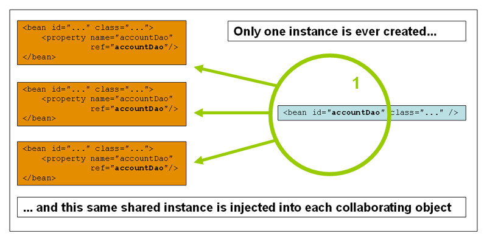

####7.5.1 单例作用域

对于单例bean，Spring容器只管理它的一个*共享*实例，并且对通过id或ids与该bean定义匹配的bean的所有请求都会导致Spring容器返回一个特定的bean实例。

换句话说，当明确一个bean定义且设置其作用域为单例时，Spring IoC容器将仅创建由这个bean定义描述的对象的*一个*实例。这个唯一实例存储在这样的单例bean缓存中，而且对这个已经被命名的bean的*所有后续请求和引用*都返回该缓存对象。



Spring的单例bean的概念不同于“四人帮”(GoF)的《设计模式》书中定义的单例模式。GoF的单例以硬编码的方式将对象的作用域限定为*每个ClassLoader*创建一个特定类的*唯一一个*实例。Spring的单例的作用域则是*一个容器一个实例*。这意味着如果在单一Spring容器中为特定的类定义一个bean，那么Spring容器将创建由该bean定义描述的类的*唯一一个*实例。*单例作用域是Spring中的默认作用域*。要在XML中将一个bean定义为单例，可以这样写：

```xml
<bean id="accountService" class="com.foo.DefaultAccountService"/>

<!-- the following is equivalent, though redundant (singleton scope is the default) -->
<bean id="accountService" class="com.foo.DefaultAccountService" scope="singleton"/>
```

